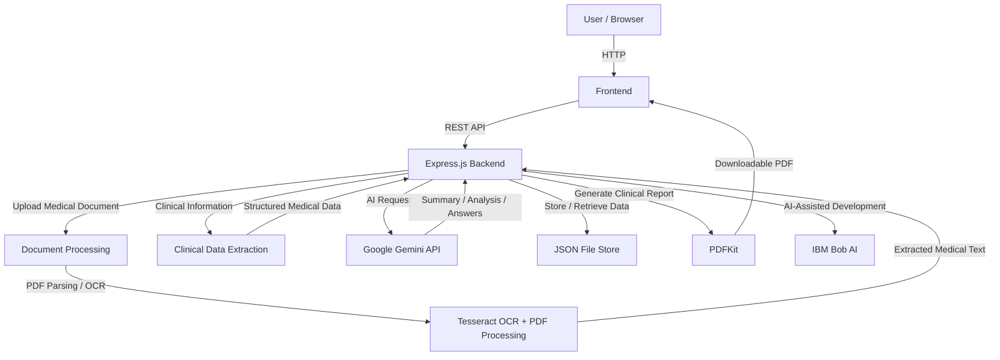

````markdown
# Architecture

## System Architecture

Medical Report AI is a full-stack medical document intelligence platform. The user interacts with the application through the frontend, while the backend manages document uploads, document processing, OCR, clinical information extraction, AI analysis, question answering, data storage, and report generation.


````

## Components

| Component                | Technology                     | Responsibility                                                                                                                                              |
| ------------------------ | ------------------------------ | ----------------------------------------------------------------------------------------------------------------------------------------------------------- |
| Frontend                 | TypeScript / JavaScript        | Provides the user interface for uploading medical documents, viewing extracted information, reading AI summaries, asking questions, and downloading reports |
| Backend API              | Node.js + Express.js           | Handles REST API requests, business logic, document processing, AI orchestration, data management, and report generation                                    |
| Document Processing      | PDF Processing + Tesseract OCR | Extracts readable text from uploaded PDF documents and images, including scanned medical documents                                                          |
| Clinical Data Extraction | Backend Processing             | Identifies and organizes relevant medical information such as diagnoses, medications, laboratory results, and vital information                             |
| AI / ML                  | Google Gemini API              | Generates patient summaries, clinical analysis, and answers to questions based on uploaded medical records                                                  |
| IBM Technology           | IBM Bob AI                     | Supports AI-assisted development and contributes to the project's AI development workflow                                                                   |
| Database / Storage       | JSON File Store                | Stores application data and processed information for the prototype                                                                                         |
| Report Generation        | PDFKit                         | Creates downloadable PDF clinical reports from the processed medical information                                                                            |

## Data Flow

The system processes medical documents through several stages, from user upload to AI-generated insights and downloadable reports.

1. **Document Upload**
   The user selects a medical PDF or image through the frontend application.

2. **API Request**
   The frontend sends the uploaded document to the Express.js backend using a REST API request.

3. **Document Processing**
   The backend determines the appropriate processing method for the uploaded document. PDF documents are parsed, while scanned documents and images can be processed using OCR.

4. **OCR and Text Extraction**
   Tesseract OCR extracts text from images or scanned medical documents when machine-readable text is not directly available.

5. **Clinical Information Extraction**
   The extracted medical text is processed to identify useful clinical information such as diagnoses, medications, laboratory results, and vital information.

6. **AI Analysis**
   The processed medical information is sent to the AI service for analysis and summary generation.

7. **Summary Generation**
   The AI generates a structured and understandable summary of the patient's uploaded medical information.

8. **Question Answering**
   The user can ask questions about the uploaded records. The backend uses information from the uploaded documents to provide document-grounded answers.

9. **Data Storage**
   Relevant application and processed information is stored using the JSON file store used by the prototype.

10. **Clinical Report Generation**
    When requested, the backend uses PDFKit to generate a downloadable clinical report containing the processed information and AI-generated insights.

11. **Result Delivery**
    The generated summary, extracted information, answers, and PDF report are returned to the frontend and presented to the user.

## Security Considerations

The current project is a hackathon prototype, so security is implemented at a basic level. The following practices are used or planned:

- API keys and other sensitive configuration values are stored in environment variables rather than hard-coded into the source code.

- `.env` files are excluded from Git using `.gitignore`.

- API credentials are not intended to be committed to the public repository.

- Uploaded medical documents are sent to the backend for processing instead of exposing backend processing credentials to the frontend.

- AI-generated information is presented as decision-support information and should not be treated as a replacement for professional clinical judgment.

- The system should not be considered a production-ready healthcare information system without additional security and compliance measures.

For a production deployment, additional security measures would be required, including:

- User authentication and authorization.
- Role-based access control.
- Encryption of medical documents and stored data.
- Secure document storage.
- HTTPS for all communications.
- Audit logging.
- Input validation and file-type restrictions.
- File-size limits and malware scanning.
- Secure API rate limiting.
- Healthcare data privacy and compliance controls.

## Scalability Notes

The current implementation is designed as a hackathon prototype and uses a JSON file store and direct AI API requests. This approach is sufficient for demonstrating the core functionality but would need architectural improvements for large-scale deployment.

The system could be scaled by:

- Replacing the JSON file store with a production database such as PostgreSQL.

- Moving uploaded documents to dedicated object storage rather than local application storage.

- Moving OCR and large document processing tasks to background workers.

- Using a message queue for long-running document-processing and AI tasks.

- Adding caching for repeated document queries and frequently requested information.

- Adding request queues and rate limiting for AI API calls.

- Running multiple stateless backend instances behind a load balancer.

- Adding monitoring, centralized logging, and application health checks.

- Implementing stronger authentication and role-based access control.

- Separating document processing, AI processing, report generation, and API services into independently scalable services if the application grows significantly.

The main performance bottlenecks at larger scale would likely be OCR processing, large medical documents, AI API response time, and report generation. Background processing and asynchronous job queues could prevent these operations from blocking normal user requests.

```

### This is the complete file

It contains **all 5 sections from your template**:

1. ✅ **System Architecture**
2. ✅ **Components**
3. ✅ **Data Flow**
4. ✅ **Security Considerations**
5. ✅ **Scalability Notes**

And the Mermaid diagram is also replaced with the **Medical Report AI architecture**, rather than leaving the example React/FastAPI/watsonx/Slack architecture.

**Don't move to `src/` yet.** Send me your **`docs/setup-guide.md`** file/template next, and we'll do that **file by file**.
```
